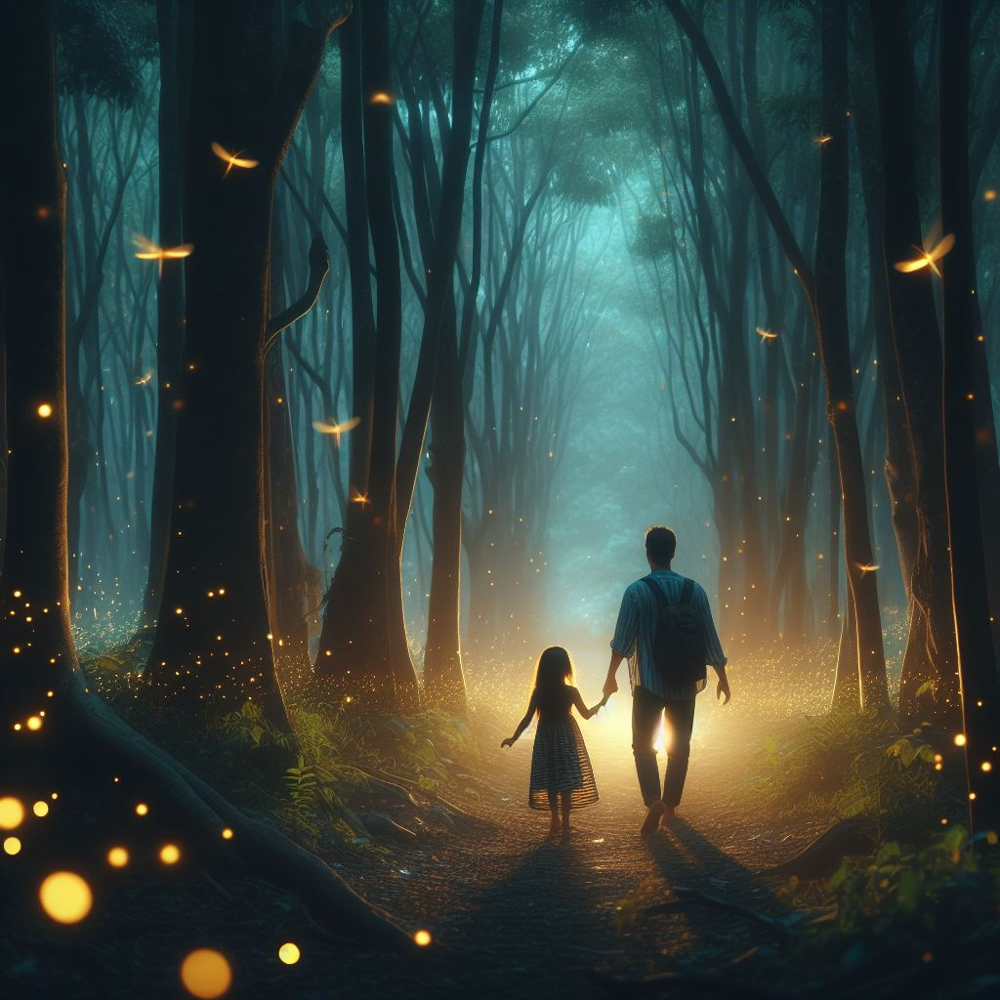
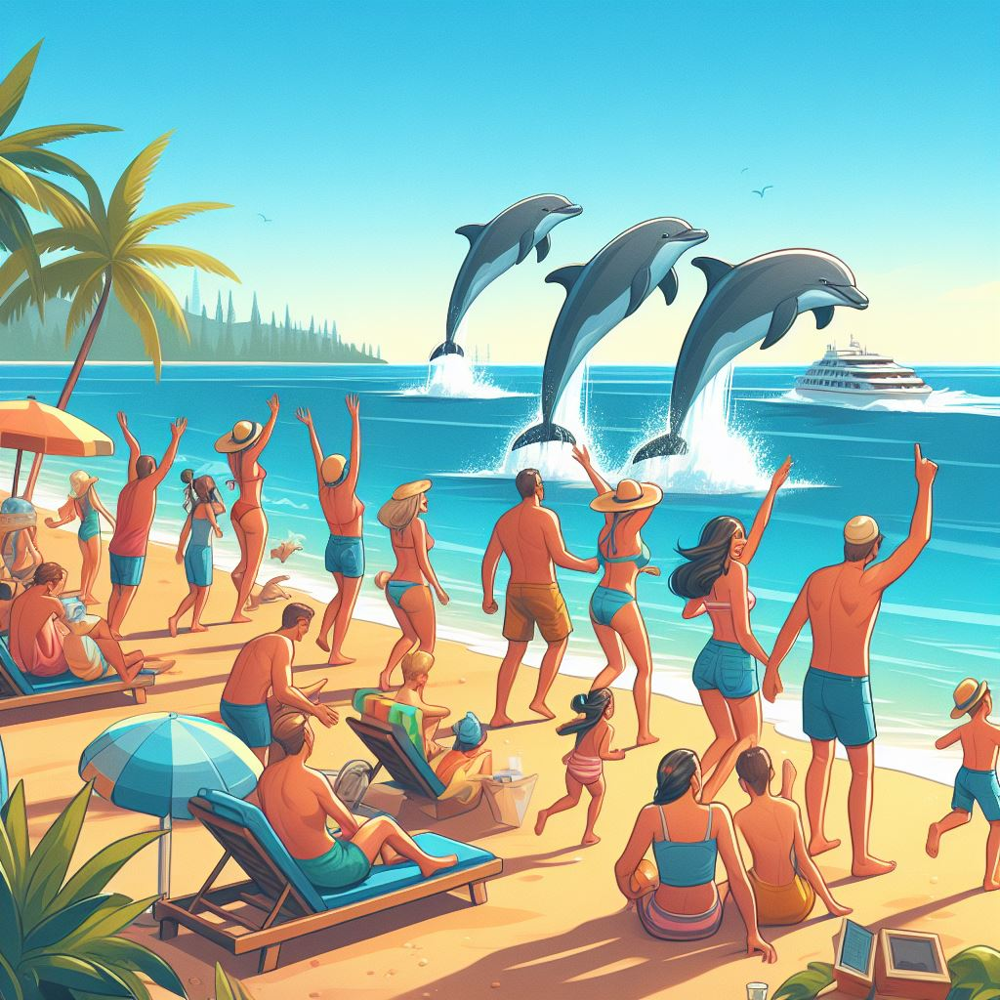
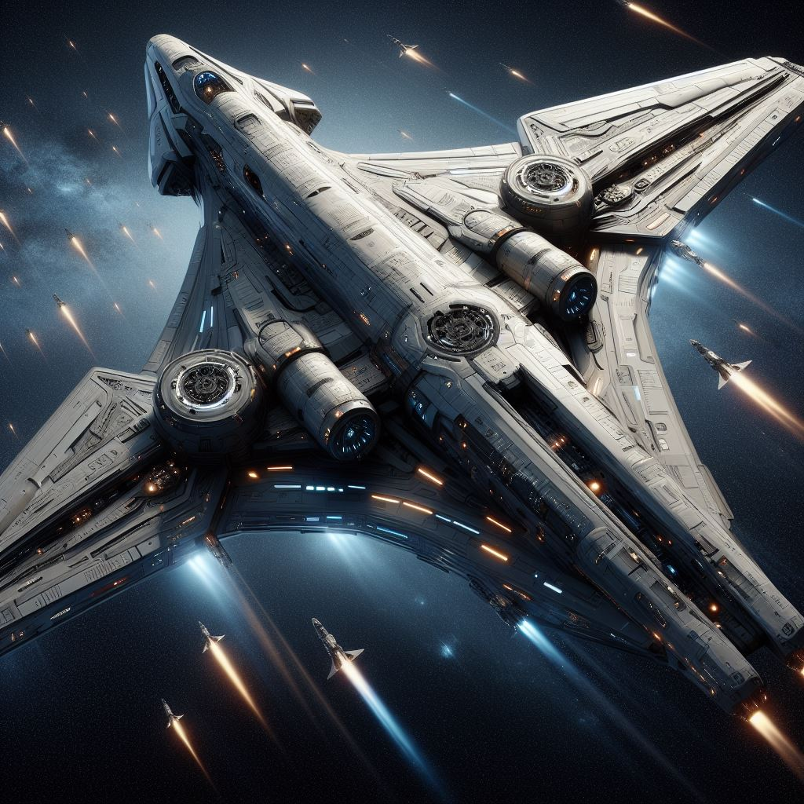
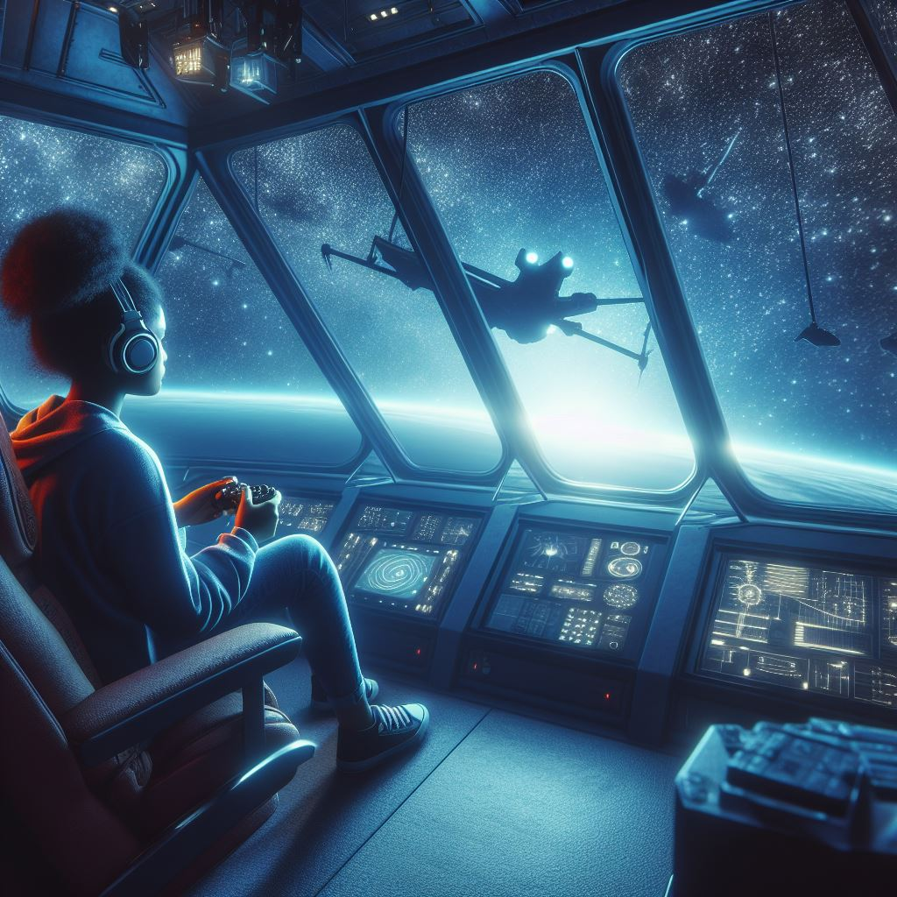
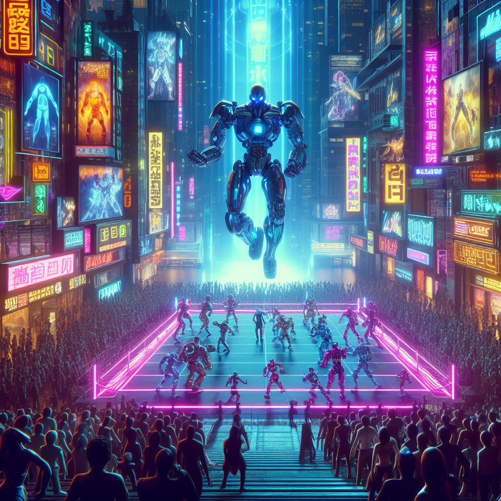
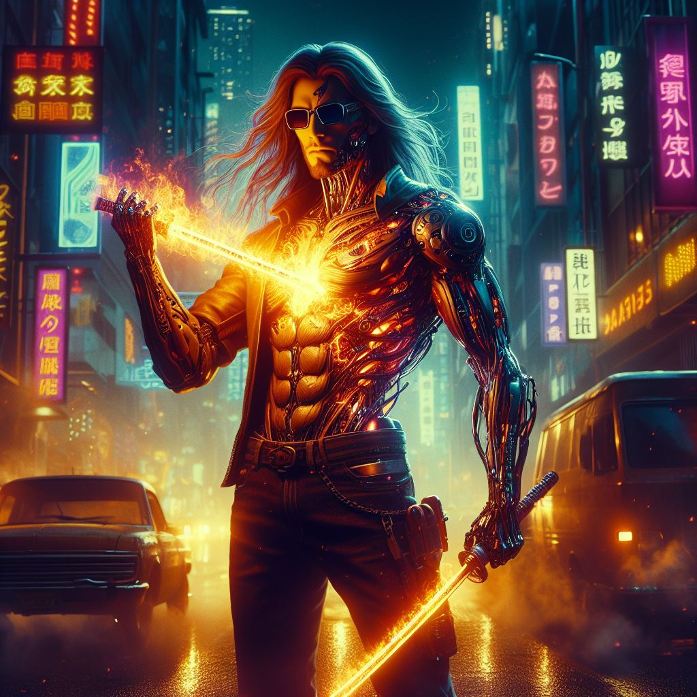

# AIPortfolio
AI web sitesi ve AI görseller

## Site Yayınlanmıştır.
[devaeterne](https://ai.safaksariyildiz.com)

# Prompts
- Web Sitesi ChatGPT ile hazırlanmış js ve css dosyalarında oynama yapılmıştır. code pen ve bir kaç portfolio sitesinden alıntılar yapılmıştır.
- Görseller CoPilot tarafından oluşturulmuştur.

## Web sitesi 
> "Merhaba, ben Devaeterne. Yapay zeka kullanarak oluşturduğum illustrasyonları sergileyebileceğim 
bir portfolio sitesine ihtiyacım var. Site OnePage özellikli olmalı.

Header Kısmı:
- Logo (Header bölümün en solunda bulunmalı)
- About Us (sitenin hakkımızda bölümüne mention edilmeli)
- Portfolio (sitenin portfolio gallery bölümüne mention edilmeli)
- Contact (sitenin contact bölümüne mention edilmeli)

Logo : 
- logo için bir svg dosyası ekleecek DevAeterne sanatçısı için "DA" şeklinde bir svg logo üretilecek
Hakkımızda Kısmı:
- Sanatçının bilgileri
sanatçı yapay zeka kullanarak detaylı dijital illustralar üretiyor.(propmt mühendisliği ile)
Portfolio kısmı : 
- Portfolio'da oluşturduğumuz görselleri sergileyeceğimiz bir galeri carauseli
- bir kaç örnek resim eklenmeli 

İletişim Kısmı:
- Bir iletişim formu
- Sosyal medya bağlantıları

Bu bilgilerle, yapay zeka tarafından oluşturulacak bir web sitesi tasarımı için yardım almak istiyorum. 
bu site için boostrap css ve html kullanmanılmalı. 
tema dark ve light özelliği barındırmalı. 
responsive özellikli ve kullanıcı dostu olmalı
Ancak, belirli düzeltmeler yapılması gerektiğini düşünüyorum. Özellikle, tasarımın kullanıcı dostu olması ve görsel açıdan çekici olması benim için önemli. 
Ayrıca, responsive tasarımın da sağlanması gerekiyor.
bu web sitesi için html, css ve Javascript kodlarını benim için yazar mısın ? "

## Catching Firefly
 > "Ormanın derinliklerinde yürüyen bir baba ve kızının, loş ışık altında karşılaştığı büyüleyici bir manzara: Ağaçların arasında dans eden ateş böceği sürüsü. Babanın yüzündeki şaşkınlık ve kızının merak dolu bakışları, doğanın bu büyüleyici gösterisine hayranlıkla şahitlik ederken hissedilen huzur ve şaşkınlık."

##  Dolphin Race
> "Bir sahil kenarında güneşlenen insanların dikkatini çeken bir olay oluyor. Yunuslar yarışmaya başlıyor ve bu güzel görüntü sayesinde tüm sahil bu keyifli yarışı seyretmeye başlıyorlar."

##  Aurora IX
> "2035 yılında, insanlık gezegenimizin sınırlarını aşmak için devrim niteliğinde bir adım atmaya hazırlanıyor. Uzun süreli keşif ve kolonizasyon misyonları için tasarlanan "Aurora IX" adlı uzay mekiği, bilim ve teknolojinin en son yeniliklerini bir araya getiriyor. Bu heybetli gemi, uzay boşluğunda yıllarca yolculuk yapabilecek ve insanlığın sınırlarını genişletecek.

"Aurora IX", özel olarak tasarlanmış güneş panelleri ve nükleer enerji jeneratörleriyle donatılmıştır, böylece sonsuz uzayda enerji sağlayabilir. Ayrıca, olağanüstü dayanıklı bir karbon fiber gövdeye ve radyasyon koruma sistemlerine sahiptir, böylece uzun süreli yolculuklar sırasında mürettebatın güvenliğini sağlar.

Mekik, sıradışı bir iç mekana sahiptir; ferah yaşam alanları, laboratuvarlar, eğlence tesisleri ve bitki yetiştirme odaları ile donatılmıştır. Ayrıca, yapay zeka destekli bir sistem, mürettebatın fiziksel ve zihinsel sağlığını izler ve korur.

"Aurora IX" uzay mekiği, insanlığın evrendeki yerini keşfetmek için cesur bir adımı temsil ediyor. Bilim kurgu görsellerindeki gibi, bu muazzam gemi, insanlığın hayal gücünü sınırlarını zorlayacak uzay maceralarının başlangıcını simgeliyor."

##  Aurora IX Game room :
> "Aurora IX'in ferah gözlem odasında, devasa pencerelerden uzayın sonsuzluğuna bakarken, bir kız oyun konsoluyla meşguldür. Uzay gemisinin iç mekanı, yumuşak mavi ışıklarla aydınlatılmıştır ve pencereden gelen ışık, odanın içine doğal bir ışıltı katmaktadır. Kız, rahat bir koltukta oturmuş, başındaki uzay temasıyla uyumlu bir başlıkla oyununun keyfini çıkarırken, ellerinde oyun kumandasıyla hızla hareket eder. Yüzünde bir kararlılık ve heyecan karışımı vardır, gözleri ekrana kilitlenmiştir ve uzayın derinliklerinde geçen oyun macerasına tamamen odaklanmıştır. Arkasında, yıldızlar arasında süzülen Aurora IX'in silueti görünürken, odanın içindeki diğer detaylar sessizlik ve huzur içinde kaybolur. Bu görsel, uzayın büyüleyici manzarasını keşfederken, kızın iç dünyasındaki eğlence ve merakı yansıtır, teknolojinin getirdiği sonsuz olanaklarla birleşen bir macera anını yakalar."

## MartialArt by Robots :
> "Gece ışıkları altında, neon renkli bir şehrin beton yolları üzerinde, 2100 yılında düzenlenen bir cyberpunk temalı robot dövüş turnuvası başlamak üzeredir. Gökdelenlerin yükseldiği ve holografik reklamların havada asılı durduğu şehir manzarası, geleceğin teknolojik ilerlemesi ve kaosuyla doludur. İnsanlar, robotlar ve yapay zekalar, bu görkemli arenada yerlerini almış, heyecanla beklemektedirler.

Ortada, devasa bir dövüş arenası yükselir, üzerinde dev robotlarla dolu platformlar ve izleyicilerin nefesini kesecek şekilde tasarlanmış ışık ve efektlerle dolu. Arenanın etrafında, binlerce insan ve yapay zeka izleyici, yüksek binaların balkonlarından ve dev ekranlardan dövüşleri izlemeye hazırlanırken, atmosfer adrenalin doludur.

Robot dövüşçüler, birbiriyle çarpışmak için arenaya girerken, her biri kendi benzersiz tasarımı ve yetenekleriyle donatılmıştır. Bazıları çelikten yapılmış devasa kollara, diğerleri ise hızlı ve çevik hareket edebilen yapay zekalara sahiptir. Arenanın ortasında, ışıklar altında parlayan iki robot, birbirlerine meydan okuyarak, izleyicilere nefes kesen bir mücadele sunmak üzeredir."
## Humanoid :
> "Geceleyin, neon ışıklar altında parlayan bir cyberpunk şehrinin sokaklarında, yarı insan yarı robot bir humanoid, uzun saçları ve güneş gözlükleriyle dikkat çekiyor. Bu sıra dışı varlık, göğsünde yükselen bir alevle birlikte, elindeki bir enerji kılıcıyla bir araç ya da binayı ateşe veriyor. Saçları rüzgarda savrulurken, yüzünde bir kararlılık ve karanlık bir tatmin ifadesi vardır.

Güneş gözlükleri, yüzünün çoğunu gizlerken, altından çıkan soğuk bir metalik bakış dikkat çeker. Yarı robot kısmı, parlak neon ışıkların altında parlayan metalik parçalarla süslenmiştir ve vücudunun çeşitli bölgelerinde karmaşık devreler ve bağlantılar görünür. Bu varlık, insan ve makine arasında ince bir dengeyi temsil ederken, aynı zamanda şehrin karanlık sokaklarında bir devrimci olarak da hareket ediyor gibi görünüyor.

Alevlerin arasında yürürken, bu yarı insan yarı robot varlık, cyberpunk dünyasının karmaşıklığını ve kaosunu yansıtan bir figür olmanın ötesinde bir şeydir. İzleyicilere, insanlık ile makine arasındaki sınırları ve içsel çatışmaları keşfetmeye davet ederken, aynı zamanda isyankar ve kararlı bir ruhu simgeler."